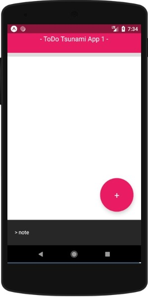

# To Do App

## About

This is an app simple for a to do task list.   
You can also use for list yours notes.   
Just write the note or the task and click the + button.   
Then will save with text and date.

## Build With

* React Native
* Expo
* Nodejs v10
* Npm v6

## Access

Actually you can access via Expo in link:  
[https://expo.io/@braianmendes/ToDoTsunamiApp1](https://expo.io/@braianmendes/ToDoTsunamiApp1)  
  
Or you can access via the QR Code in Expo:

